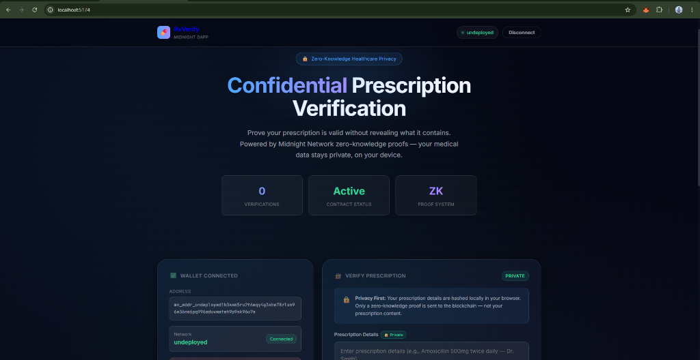
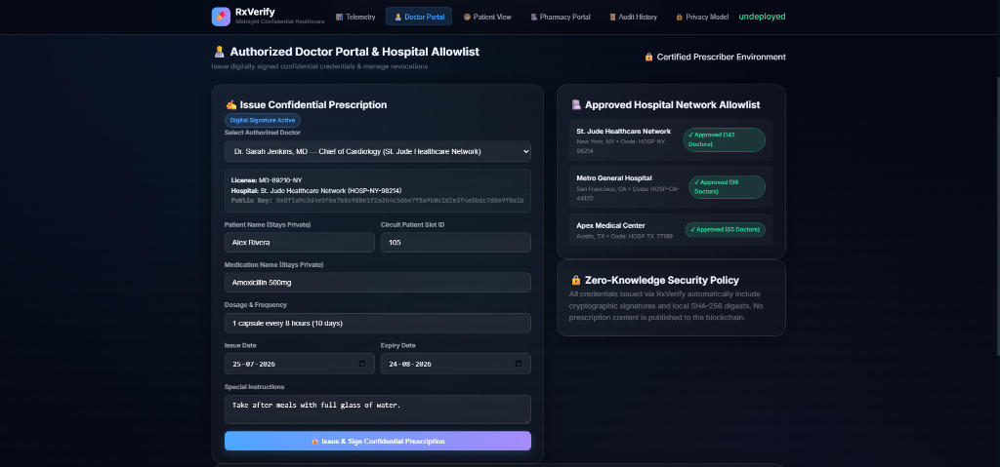
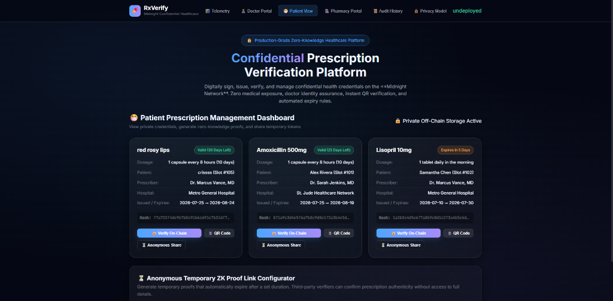

# 🏥 Confidential Prescription Verification Platform (RxVerify)

[](https://github.com/shouvik7majumdar/confidential-prescription/actions/workflows/ci.yml)
[](https://midnight.network)
[](https://midnight.network)
[](https://midnight.network)
[](https://opensource.org/licenses/MIT)

# Project Overview

The **Confidential Prescription Verification Platform (RxVerify)** is a production-grade, privacy-preserving healthcare application built on the **Midnight Network** using **Compact** smart contracts and Zero-Knowledge proofs (zk-SNARKs). RxVerify enables patients, certified healthcare prescribers, and licensed pharmacies to issue, verify, manage, and revoke medical prescriptions without exposing sensitive Personal Health Information (PHI), diagnostic data, or patient identities on-chain.

---

# Application Preview

## Landing Page



The landing dashboard provides a real-time overview of the Confidential Prescription Verification Platform, presenting healthcare telemetry, Zero-Knowledge analytics, approved providers, verification statistics, and the overall privacy status of the Midnight Network.

---

## Prescription Issue Page



The Doctor Portal enables authorized healthcare professionals to securely issue digitally signed confidential prescriptions. Doctors can select approved providers, define medication details, configure expiry dates, and generate privacy-preserving prescription credentials protected by Midnight Protocol.

---

## Verification Page



The Pharmacy Verification Portal allows authorized pharmacies to instantly verify confidential prescriptions using Zero-Knowledge Proofs without exposing sensitive medical information. Verification can be performed using a QR code or confidential verification token while maintaining complete patient privacy.

---

# 🌐 Live Application

The Confidential Prescription Verification platform is deployed and publicly accessible:

▶ **[Open the Live Application](https://confidential-prescriptionnn.vercel.app/)**

---

# 🎥 Live Demo

Watch the complete demonstration of the Confidential Prescription Verification Platform built on Midnight Protocol:

▶ **[Watch the complete project demonstration on YouTube](https://youtu.be/-8m0TcUsUUc)**

---

# 🔗 Contract Deployment Details

| Field | Value |
| :--- | :--- |
| **Contract Address** | `15973ac8d96a98faec7d1a4a2d429ee522ca2b5c0e1b3b97cda44cd76da080ef` |
| **Deployer Address** | `mn_addr_undeployed1h3ssm5ru2t6eqy4g3she78zlxn96e36ms6pq996aduvmateh9p9sk96u7s` |
| **Network Environment** | `undeployed` (Local Midnight Devnet) / Compatible with `preprod` |
| **Deployment Method** | Compiled with Compact Compiler v0.31; deployed via `npm run setup` orchestrator script |
| **Deployment Status** | 🟢 **Active & Deployed** |
| **Deployment Timestamp** | `2026-07-27T14:08:21.515Z` |
| **Midnight Preprod Explorer** | [View on Midnight Explorer](https://explorer.midnight.network/contract/15973ac8d96a98faec7d1a4a2d429ee522ca2b5c0e1b3b97cda44cd76da080ef) |

---

# 🔐 Lace Wallet Integration

RxVerify features authentic browser wallet integration supporting the official **Midnight Lace Wallet** extension standard via the Midnight DApp Connector API (`window.midnight.mnLace`).

### Why Lace Wallet?
Lace Wallet is the official Web3 wallet for the Midnight Network ecosystem. It enables users to hold private keys, manage confidential credentials, and sign Zero-Knowledge proof transactions locally without exposing private keys or health data to third-party web servers.

### How Connection & Permissions Work
1. **Provider Resolution**: The application detects the injected `window.midnight.mnLace` (or `window.cardano.lace`) provider.
2. **Permission Request**: Clicking **Connect Lace Wallet** invokes the authentic `provider.enable(serviceUriConfig)` method.
3. **Genuine Extension Popup**: The browser displays the real Lace Wallet authorization modal prompting the user to grant access.
4. **Session Persistence**: Upon authorization, connected wallet metadata is saved to `sessionStorage` for seamless session management.
5. **Clean Disconnect**: Clicking **Disconnect** clears session state and resets local provider references.

### Supported Networks
* **Local Devnet (`undeployed`)**: Default local network endpoint (`ws://127.0.0.1:9944`) for local verification testing.
* **Preprod Testnet (`preprod`)**: Midnight testnet for staging and demonstration.

### Technical & Browser Notes
* Web3 browser extensions inject content scripts into web pages. Ensure Chrome extension permissions allow site access to `http://localhost:5173`.
* For local devnet testing without browser extensions active on `localhost`, the dApp includes a **🧪 Use Devnet Wallet** option to connect the local devnet deployer wallet (`mn_addr_undeployed1h3ssm...`).

---

# 🏗️ System Architecture

RxVerify follows Midnight Protocol's dual execution model:

```
┌────────────────────────────────────────────────────────────────────────┐
│                        Browser Client Layer                            │
│                                                                        │
│   React 19 ──► TypeScript 6 ──► Vite 8 ──► Glassmorphic UI CSS         │
│                                │                                       │
│                                ▼                                       │
│                   Browser Wallet (Lace Extension)                      │
│                window.midnight.mnLace.enable(...)                      │
└────────────────────────────────┬───────────────────────────────────────┘
                                 │
                                 ▼ (Local Witness & SHA-256 Hashing)
┌────────────────────────────────────────────────────────────────────────┐
│                     Off-Chain Prover Service                           │
│                                                                        │
│   Midnight Proof Server (Docker container on port 6300)                │
│   Generates zk-SNARK Proof from local witness data                     │
└────────────────────────────────┬───────────────────────────────────────┘
                                 │
                                 ▼ (Submit ZK Proof Transaction)
┌────────────────────────────────────────────────────────────────────────┐
│                     Midnight Network Blockchain                        │
│                                                                        │
│   Compact Smart Contract (contracts/prescription-verifier.compact)    │
│   - Circuit: verifyPrescription(patientId)                             │
│   - Enforces contractActive == true                                    │
│   - Discloses non-sensitive metadata via disclose(patientId)           │
│   - Increments public ledger verificationCount                         │
│                                │                                       │
│         ┌──────────────────────┴──────────────────────┐                  │
│         ▼                                             ▼                  │
│   Midnight Node (port 9944)                Midnight Indexer (port 8088) │
└────────────────────────────────────────────────────────────────────────┘
```

---

# Privacy Model

RxVerify strictly enforces private-by-default state boundaries using `disclose()` in Compact smart contracts:

| Data Item | Exposure Level | Storage Location | Privacy Guarantee |
| :--- | :--- | :--- | :--- |
| **Medication & Dosage Details** | 🔒 **Strictly Private** | Local Browser Storage | Never leaves prover device; excluded from on-chain state |
| **Prescription SHA-256 Hash** | 🔒 **Strictly Private** | Prover Local Witness | Evaluated in local ZK circuit; first-byte validated privately |
| **Doctor Digital Signature** | 🔒 **Strictly Private** | Prover Local Witness | Cryptographically checked in local ZK prover |
| **Patient Slot ID** | 👁️ **Disclosed Metadata** | Circuit Parameter (`patientId`) | Disclosed via `disclose()` for session state isolation |
| **Verification Counter** | 🌐 **Public Ledger** | On-Chain (`verificationCount`) | Incremented publicly upon valid proof acceptance |
| **Contract Active Status** | 🌐 **Public Ledger** | On-Chain (`contractActive`) | Public boolean flag controlling contract state |

---

# Smart Contract Overview

The Compact smart contract (`contracts/prescription-verifier.compact`) defines the core zero-knowledge verification rules:

```compact
pragma language_version >= 0.23;

import CompactStandardLibrary;

export ledger verificationCount: Uint<64>;
export ledger contractActive: Boolean;

witness prescriptionHash(): Bytes<32>;
witness doctorSignature(): Bytes<64>;

export circuit verifyPrescription(patientId: Uint<32>): [] {
    assert(contractActive == true, "Contract is not accepting verifications");
    const hash = prescriptionHash();
    const sig  = doctorSignature();
    const hashFirstByte = hash[0];
    assert(hashFirstByte != 0x00, "Prescription hash must be non-zero");
    const sigFirstByte = sig[0];
    assert(sigFirstByte != 0x00, "Doctor signature must be non-zero");
    disclose(patientId);
    verificationCount = (verificationCount + 1) as Uint<64>;
}

export circuit deactivate(): [] {
    contractActive = false;
}

export circuit activate(): [] {
    contractActive = true;
}
```

---

# Frontend Overview

The web frontend provides an intuitive glassmorphic interface organized into navigation workflows:

- **📊 Telemetry & ZK Analytics**: Real-time stats grid for Issued, Verified, Expired, Revoked, Active Doctors, and Approved Hospitals.
- **👨‍⚕️ Doctor Portal**: Digital prescription creation form, hospital allowlist registry, success confirmation banner, and revocation manager.
- **😷 Patient View**: Multi-credential manager with local decryption view, ZK proof generator, and temporary sharing link configurator.
- **🏥 Pharmacy Portal**: Streamlined QR scanning and ZK token verification workspace.
- **📜 Audit History**: Confidential event trail of issuances, verifications, and revocations.
- **🔒 Privacy Model & Ledger State**: Public state inspector reading on-chain contract parameters.

---

# Installation & Local Setup

### Prerequisites
- **Node.js**: `v22.0.0` or higher
- **Docker & Docker Compose** (for running local Midnight node, indexer, and proof server)
- **Compact Compiler**: `v0.31.1` (`compact` executable)

### 1. Clone & Install Dependencies
```bash
git clone https://github.com/shouvik7majumdar/confidential-prescription.git
cd confidential-prescription

# Install root dependencies
npm install

# Install UI dependencies
cd ui && npm install && cd ..
```

### 2. Start Local Proof Server & Devnet Nodes
```bash
npm run proof-server:start
```
*Starts Docker containers for Midnight Node (port 9944), Indexer (port 8088), and Proof Server (port 6300).*

### 3. Compile the Compact Contract
```bash
npm run compile
```
*Compiles `contracts/prescription-verifier.compact` to `contracts/managed/prescription-verifier`.*

### 4. Deploy Contract to Local Devnet
```bash
npm run setup -- --network undeployed
```

### 5. Launch Web Frontend
```bash
npm run dev:ui
```
*Opens Vite React application at `http://localhost:5173`.*

---

# Testing & Quality Assurance

Run the full Vitest test suite covering contract logic, network configuration, privacy witnesses, and domain services:

```bash
# Execute unit & integration tests
npm test
```

To build the production UI bundle:
```bash
# Compile TypeScript and bundle frontend
npm run build
```

---

# CI/CD Pipeline

GitHub Actions runs an automated workflow (`.github/workflows/ci.yml`) on every pull request and push to `main`:
1. Installs Node.js v22 environment and dependencies.
2. Compiles Compact smart contract using the compiler.
3. Executes the 30-test Vitest suite.
4. Verifies UI frontend bundle compilation (`npm run build`).

---

# Security & Privacy

RxVerify guarantees complete patient privacy through cryptographic zero-knowledge proofs. Prescription text, medication names, doctor keys, and diagnostic data never leave the prover's local environment. The blockchain only processes zk-SNARK proof artifacts confirming credential validity.

---

# License

This project is licensed under the **MIT License**.