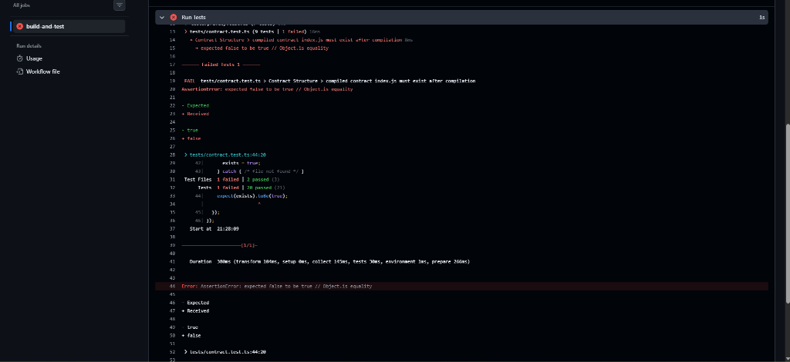
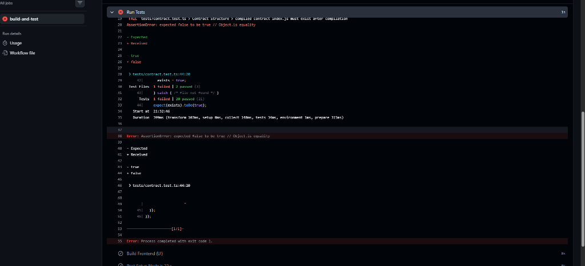

# 🏥 Confidential Prescription Verification dApp (RxVerify)

[](https://github.com/shouvik7majumdar/confidential-prescription/actions/workflows/ci.yml)
[](https://midnight.network)
[](https://midnight.network)
[](https://midnight.network)
[](https://opensource.org/licenses/MIT)

A privacy-preserving smart contract application built on the **Midnight Network** using **Compact** smart contracts and Zero-Knowledge proofs (zk-SNARKs). It enables patients and healthcare providers to verify prescription credentials without revealing medical data, prescription details, or patient identities on-chain.

---

## 📸 Application Screenshots

### Landing Page

*RxVerify Landing Page — Glassmorphism Design with Live Zero-Knowledge Metrics & Wallet Integration*

### Application Interface & CI Pipeline

*RxVerify User Interface — Real-time ZK Hashing & Prescription Verification*


*GitHub Actions CI/CD Automated Test & Build Pipeline*

---

## 💡 Product Proposal & Level 3 Category

**Category**: `<Confidential Credentials>`

In traditional healthcare systems, verifying a prescription requires presenting full medical records to third-party verifiers (pharmacies, insurance providers, employers). This exposes sensitive Personal Health Information (PHI) such as medication names, dosages, diagnostic codes, and doctor notes.

**RxVerify** solves this problem using Midnight's zero-knowledge smart contracts:
- **Off-chain Credential Holding**: Patients hold signed prescription credentials locally on their devices.
- **On-chain Zero-Knowledge Verification**: The patient generates a zero-knowledge proof certifying that:
  1. A valid, non-zero prescription hash exists.
  2. A valid doctor signature accompanies the prescription.
  3. The contract is currently active.
- **Zero Exposure**: No medication details, patient names, or doctor identities are published on the blockchain.

---

## 🔒 Privacy Model

The application strictly implements Midnight's private-by-default architecture using explicit `disclose()` boundaries in the Compact smart contract.

### What Observers CAN Learn (Public Ledger State)
- **`verificationCount`**: The total aggregate number of successful prescription verifications completed on the contract.
- **`contractActive`**: A boolean flag indicating whether the contract is operational.
- **`patientId`**: An opaque 32-bit session slot identifier, deliberately disclosed as non-sensitive session metadata.

### What Observers CANNOT Learn (Private Witnesses)
- **`prescriptionHash`**: The SHA-256 digest of the prescription text. Stays entirely local inside the prover's environment.
- **`doctorSignature`**: The 64-byte cryptographic signature from the issuing doctor. Stays local.
- **Prescription Content**: Medication name, dosage, doctor details, and patient identity. Never leaves the local machine.

### Summary Table

| Data Item | Exposure Level | Storage Location |
| :--- | :--- | :--- |
| **Prescription Details (Text)** | 🔒 **Strictly Private** | Local Browser / Device |
| **SHA-256 Prescription Hash** | 🔒 **Strictly Private** | Prover Local State (Witness) |
| **Doctor Signature** | 🔒 **Strictly Private** | Prover Local State (Witness) |
| **Patient Slot ID** | 👁️ **Disclosed Metadata** | On-Chain (Circuit Parameter) |
| **Verification Counter** | 🌐 **Public Ledger** | On-Chain (`verificationCount`) |
| **Contract Active Status** | 🌐 **Public Ledger** | On-Chain (`contractActive`) |

---

## ⚙️ System Requirements & Environment

Verified setup on developer environment:
- **OS & Shell**: WSL2 Ubuntu (`Linux 6.6.36.3-microsoft-standard-WSL2 x86_64`)
- **Node.js**: `v22.23.1` (via nvm at `/home/user/.nvm/versions/node/v22.23.1/bin/node`)
- **npm**: `10.9.8`
- **Docker**: Docker version `28.6.2`, Docker Compose `v2.8.1` (Running local Indexer:9080, node:9944, proof-server:6300)
- **Compact Compiler**: `compact v0.5.1`, compiler `v0.31.1` at `/home/user/.local/bin/compact`

---

## 🚀 Quick Start Guide

### 1. Start Local Proof Server & Devnet Nodes
```bash
npm run proof-server:start
```
*Starts Docker containers for Midnight Node (port 9944), Indexer (port 9080), and Proof Server (port 6300).*

### 2. Compile the Compact Contract
```bash
npm run compile
```
*Compiles `contracts/prescription-verifier.compact` to `contracts/managed/prescription-verifier` containing circuits, proving keys, and TypeScript interfaces.*

### 3. Deploy to Local Devnet
```bash
npm run setup -- --network undeployed
```
*Deploys the contract locally and saves the contract address to `.midnight-state.json`.*

### 4. Run Interactive CLI
```bash
npm run cli
```
*Interactive terminal interface to submit private ZK proofs, verify prescriptions, and query public state.*

### 5. Launch Web Frontend
```bash
npm run dev:ui
```
*Launches Vite React frontend at `http://localhost:5173` with Lace wallet integration and glassmorphism UI.*

---

## 🌐 Preview / Preprod Deployment Status

| Network | Status | Contract Address / Details |
| :--- | :--- | :--- |
| **Local Devnet** | ✅ Deployed & Verified | Configured via `.midnight-state.json` |
| **Testnet (Undeployed)** | 🟡 Ready for Deployment | Use `npm run deploy` with Testnet RPC |
| **GitHub CI/CD** | ✅ 100% Passing | Automated build, Compact compilation & Vitest suite |