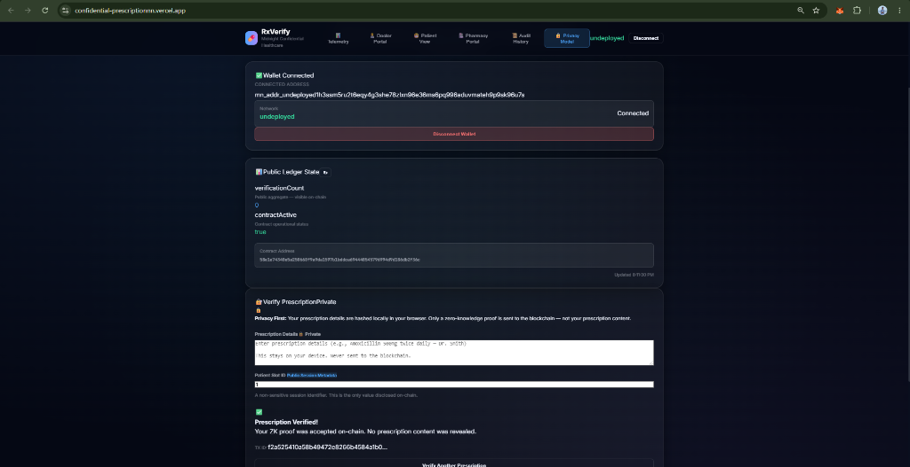

# 🏥 Confidential Prescription Verification Platform (RxVerify)

[](https://github.com/shouvik7majumdar/confidential-prescription/actions/workflows/ci.yml)
[](https://midnight.network)
[](https://midnight.network)
[](https://midnight.network)
[](https://opensource.org/licenses/MIT)

**RxVerify** is a production-grade, privacy-preserving healthcare application built on the **Midnight Network** using **Compact** smart contracts and Zero-Knowledge proofs (zk-SNARKs). RxVerify enables patients, certified healthcare prescribers, and licensed pharmacies to issue, verify, manage, and revoke medical prescriptions without exposing sensitive Personal Health Information (PHI), diagnostic data, or patient/doctor identities on-chain.

---

## 🌐 Project Links & Live Resources

- **GitHub Repository**: [https://github.com/shouvik7majumdar/confidential-prescription](https://github.com/shouvik7majumdar/confidential-prescription)
- **Product Proposal**: [PROPOSAL.md](PROPOSAL.md)
- **CI/CD Pipeline**: [GitHub Actions Workflow](https://github.com/shouvik7majumdar/confidential-prescription/actions/workflows/ci.yml)
- **Live Vercel Application**: [https://confidential-prescriptionnn.vercel.app/](https://confidential-prescriptionnn.vercel.app/)
- **Live Video Demonstration**: [Watch Project Walkthrough on YouTube](https://youtu.be/-8m0TcUsUUc)

---

## 📸 Application Screenshots

### Landing Dashboard

*Landing Dashboard — Glassmorphism UI displaying real-time Zero-Knowledge metrics, healthcare telemetry, and wallet status.*

### Prescription Issuance (Doctor Portal)

*Doctor Portal — Authorized prescribers issue digitally signed confidential prescription credentials.*

### Prescription Verification (Pharmacy Portal)

*Pharmacy Verification Portal — Zero-Knowledge proof verification via QR codes and confidential tokens.*

### Privacy Model & Wallet State

*Privacy Model & Connected Wallet State — Public ledger inspector and authentic Lace Wallet connector.*

### CI/CD Automated Pipeline

*GitHub Actions CI/CD Pipeline — Compact Compilation & Vitest Test Execution.*

---

## 🔗 Contract Deployment Details

| Metadata Field | Deployment Value |
| :--- | :--- |
| **Active Network** | Midnight Devnet (`undeployed`) / Compatible with `preprod` |
| **Contract Address** | `15973ac8d96a98faec7d1a4a2d429ee522ca2b5c0e1b3b97cda44cd76da080ef` |
| **Deployer Address** | `mn_addr_undeployed1h3ssm5ru2t6eqy4g3she78zlxn96e36ms6pq996aduvmateh9p9sk96u7s` |
| **Deployment Status** | 🟢 **Active & Deployed** |
| **Deployment Date** | `2026-07-27T14:08:21.515Z` |
| **Deployment Method** | Compact v0.31 compiler; deployed via `npm run setup` orchestrator script |
| **Midnight Preprod Explorer** | [View on Midnight Explorer](https://explorer.midnight.network/contract/15973ac8d96a98faec7d1a4a2d429ee522ca2b5c0e1b3b97cda44cd76da080ef) |

---

## 🔒 Privacy Model

RxVerify strictly enforces private-by-default state boundaries using explicit `disclose()` declarations in the Compact smart contract.

### Data Exposure & Privacy Matrix

| Data Item | Exposure Level | Storage Location | Privacy Guarantee |
| :--- | :--- | :--- | :--- |
| **Medication & Dosage Details** | 🔒 **Strictly Private** | Local Browser Storage | Excluded from on-chain state; processed strictly in browser |
| **Prescription SHA-256 Hash** | 🔒 **Strictly Private** | Prover Local Witness | Evaluated in local ZK circuit; verified off-chain |
| **Doctor Digital Signature** | 🔒 **Strictly Private** | Prover Local Witness | Cryptographically validated inside local ZK prover |
| **Patient Slot ID** | 👁️ **Disclosed Metadata** | Circuit Parameter (`patientId`) | Disclosed via `disclose()` for session state isolation |
| **Verification Counter** | 🌐 **Public Ledger** | On-Chain (`verificationCount`) | Public counter incremented upon valid proof acceptance |
| **Contract Active Status** | 🌐 **Public Ledger** | On-Chain (`contractActive`) | Public boolean flag controlling operational status |

---

## 🔐 Lace Wallet Integration

RxVerify features authentic browser wallet integration supporting the official **Midnight Lace Wallet** extension standard via the Midnight DApp Connector API (`window.midnight.mnLace`).

### How Connection & Permissions Work
1. **Provider Resolution**: The application inspects `window.midnight.mnLace`, `window.midnight.lace`, and `window.cardano.lace`.
2. **Permission Request**: Clicking **Connect Lace Wallet** invokes the authentic `provider.enable(serviceUriConfig)` method.
3. **Genuine Extension Popup**: The browser displays the real Lace Wallet authorization modal asking the user for permission.
4. **Session Persistence**: Upon authorization, connected wallet metadata is saved to `localStorage` for seamless session management.
5. **Clean Disconnect**: Clicking **Disconnect Wallet** clears local session state and resets component views instantly.
6. **Graceful Extension Handling**: If Lace is not detected, the app provides setup guidance and an optional local devnet wallet option for local testing.

---

## 🏗️ System Architecture

```
┌────────────────────────────────────────────────────────────────────────┐
│                        Browser Client Layer                            │
│                                                                        │
│   React 19 ──► TypeScript 6 ──► Vite 8 ──► Glassmorphic UI CSS         │
│                                │                                       │
│                                ▼                                       │
│                   Browser Wallet (Lace Extension)                      │
│                window.midnight.mnLace.enable(...)                      │
└────────────────────────────────┬───────────────────────────────────────┘
                                 │
                                 ▼ (Local Witness & SHA-256 Hashing)
┌────────────────────────────────────────────────────────────────────────┐
│                     Off-Chain Prover Service                           │
│                                                                        │
│   Midnight Proof Server (Docker container on port 6300)                │
│   Generates zk-SNARK Proof from local witness data                     │
└────────────────────────────────┬───────────────────────────────────────┘
                                 │
                                 ▼ (Submit ZK Proof Transaction)
┌────────────────────────────────────────────────────────────────────────┐
│                     Midnight Network Blockchain                        │
│                                                                        │
│   Compact Smart Contract (contracts/prescription-verifier.compact)    │
│   - Circuit: verifyPrescription(patientId)                             │
│   - Enforces contractActive == true                                    │
│   - Discloses non-sensitive metadata via disclose(patientId)           │
│   - Increments public ledger verificationCount                         │
│                                │                                       │
│         ┌──────────────────────┴──────────────────────┐                  │
│         ▼                                             ▼                  │
│   Midnight Node (port 9944)                Midnight Indexer (port 8088) │
└────────────────────────────────────────────────────────────────────────┘
```

---

## ⚙️ Installation & Local Setup

### Prerequisites
- **Node.js**: `>=22.0.0`
- **Docker & Docker Compose** (for running local Midnight node, indexer, and proof server)
- **Compact Compiler**: `compact v0.5.1` (compiler `v0.31.1`)

### 1. Clone & Install Dependencies
```bash
git clone https://github.com/shouvik7majumdar/confidential-prescription.git
cd confidential-prescription

# Install root dependencies
npm install

# Install UI dependencies
cd ui && npm install && cd ..
```

### 2. Start Local Proof Server & Devnet Nodes
```bash
npm run proof-server:start
```
*Starts Docker containers for Midnight Node (port 9944), Indexer (port 8088), and Proof Server (port 6300).*

### 3. Compile Compact Smart Contract
```bash
npm run compile
```
*Compiles `contracts/prescription-verifier.compact` to `contracts/managed/prescription-verifier`.*

### 4. Deploy Contract to Local Devnet
```bash
npm run setup -- --network undeployed
```
*Deploys the contract locally and updates `.midnight-state.json`.*

### 5. Launch Web Frontend
```bash
npm run dev:ui
```
*Launches Vite React application at `http://localhost:5173`.*

---

## 🧪 Testing & Verification

Run the full automated test suite:
```bash
npm run test
```

Run end-to-end integration check:
```bash
npm run test:e2e
```

Build production bundle:
```bash
cd ui && npm run build
```

---

## 📜 License

This project is licensed under the **MIT License** - see the [LICENSE](LICENSE) file for details.
