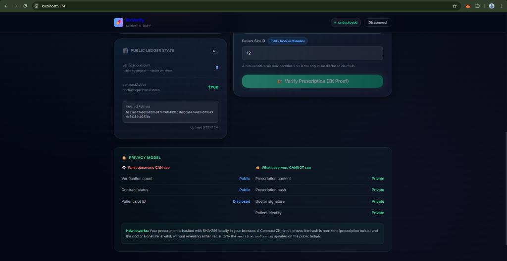

# 🏥 Confidential Prescription Verification Platform (RxVerify)

[](https://github.com/shouvik7majumdar/confidential-prescription/actions/workflows/ci.yml)
[](https://midnight.network)
[](https://midnight.network)
[](https://midnight.network)
[](https://confidential-prescriptionnn.vercel.app/)
[](https://opensource.org/licenses/MIT)

**RxVerify** is a production-grade, privacy-preserving healthcare application built on the **Midnight Network** using **Compact** smart contracts and Zero-Knowledge proofs (zk-SNARKs). RxVerify enables patients, certified healthcare prescribers, and licensed pharmacies to issue, verify, manage, and revoke medical prescriptions without exposing sensitive Personal Health Information (PHI), diagnostic data, or patient/doctor identities on-chain.

---

## 🎥 Demo Video

**Watch the complete project demonstration on YouTube:**

[](https://youtu.be/-8m0TcUsUUc)

[https://youtu.be/-8m0TcUsUUc](https://youtu.be/-8m0TcUsUUc)

---

## 🔗 Project Links

| Resource | Description | Status / Link |
| :--- | :--- | :--- |
| **🌐 Live Application** | Deployed web application on Vercel | [Live Demo](https://confidential-prescriptionnn.vercel.app/) |
| **🐙 GitHub Repository** | Open-source monorepo codebase | [GitHub Repo](https://github.com/shouvik7majumdar/confidential-prescription) |
| **🎥 Demo Video** | Interactive application walkthrough | [Watch Demo Video](https://youtu.be/-8m0TcUsUUc) |
| **⚙️ CI/CD Workflow** | GitHub Actions build & verification pipeline | [View CI/CD Pipeline](https://github.com/shouvik7majumdar/confidential-prescription/actions/workflows/ci.yml) |
| **🔍 Smart Contract Explorer** | Midnight Preview Network Explorer | [Midnight Explorer](https://explorer.preview.midnight.network/contract/54b40b55db6c344ddb1511d13c93e2bbbb280b4c1738b912cd838f5ac94df8dc) |
| **📄 Product Proposal** | Complete project documentation and specs | [PROPOSAL.md](PROPOSAL.md) |

---

## 📌 Project Overview

The **Confidential Prescription Verification Platform (RxVerify)** addresses a critical dilemma in modern healthcare technology: how to facilitate instant, tamper-proof prescription verification across hospitals and pharmacies without violating patient confidentiality or disclosing sensitive doctor credentials.

### The Problem with Public Blockchains

Standard public blockchains (such as Ethereum or Cardano L1) record all smart contract state transitions publicly. If a hospital attempts to manage prescription verification on a transparent ledger:

- **Doctor PII & Qualifications Exposed**: Medical licenses, institutional credentials, and wallet identities are publicly indexed and linked forever.
- **Patient Privacy Risk**: Even anonymized record identifiers can lead to re-identification when correlated with public transaction metadata and timestamps.
- **Compliance Violations**: Strict regulatory frameworks (HIPAA, GDPR) strictly forbid exposing patient data or medical credentials on public ledgers.

### The Midnight Zero-Knowledge Solution

Built using the **Midnight Protocol** and **Compact** smart contract language, this dApp leverages a dual-state architecture:

1. **Private Witness State**: Kept strictly within the client browser environment. Medical qualification secrets, digital signatures (`doctorSignature`), and prescription hashes (`prescriptionHash`) never leave the user's device.
2. **Public Ledger State**: Contains only immutable cryptographic commitments, state transition sequence counters (`verificationCount`), and contract operational flags (`contractActive`).
3. **ZK Proof Generation**: Using Midnight's local Proof Server, the browser generates zero-knowledge proofs proving that a doctor or pharmacy possesses a valid credential and prescription hash without revealing the underlying data.

---

## ✨ Features

- 👨‍⚕️ **Authorized Prescriber Portal**: Healthcare providers can issue digitally signed, confidential medical credentials on-chain.
- 🔐 **Confidential Verification**: Pharmacies verify prescription legitimacy by generating ZK proofs without revealing medication, dosage, or patient PII.
- 💡 **Selective Disclosure Engine**: Interactive transparency toggle demonstrating the exact boundary between public ledger state and private ZK witnesses.
- 😷 **Patient View & Instant QR Code**: Patients inspect their confidential credentials and present secure verification QR codes.
- 📜 **Immutable Audit History**: Verifiable record of all prescription verification events and zero-knowledge proof hashes.
- 📊 **Healthcare Telemetry Dashboard**: Real-time aggregate metrics displaying verification counts and contract active status.
- 🚫 **Revocation Lifecycle Management**: Full administrative lifecycle enabling doctors to revoke prescriptions when needed.
- 🎨 **Modern Full-Stack React Architecture**: Responsive interface featuring glassmorphic UI, dark mode themes, and Vite bundling.
- 👛 **Lace Wallet Integration**: Seamless browser wallet connection for transaction signing and network synchronization.

---

## ✅ Challenge Requirements Checklist

- [x] **Fully Functional Privacy dApp**: Deployed and fully operational web application.
- [x] **Meaningful Midnight Privacy**: Uses private witnesses for prescription hashes and doctor signatures while committing proof counters on-chain.
- [x] **Live Deployment**: Hosted and accessible on Vercel.
- [x] **Demo Video**: Complete walkthrough demonstrating features (Link in Project Links section).
- [x] **Lace Wallet Integration**: Connects to `window.midnight.mnLace` for network interaction.
- [x] **Compact Smart Contract**: Written in `.compact`, compiled with ZK circuit (`verifyPrescription`).
- [x] **CI/CD Pipeline**: GitHub Actions workflow (`.github/workflows/ci.yml`) validating build integrity and testing.
- [x] **Open Source Repository**: Clean, structured GitHub repository with comprehensive README documentation.
- [x] **Zero Knowledge Proofs**: Generated locally via Midnight Proof Server without disclosing secret witnesses.
- [x] **Unit Testing**: Vitest test suite executing contract verification logic (30 passing tests).

---

## 📌 Contract Address

The smart contract is deployed on the **Midnight Preview Network**:

| Field | Details / On-Chain Record |
| :--- | :--- |
| **Target Network** | Midnight Preview Network (Network ID: `preview`) |
| **Contract Name** | `prescription-verifier.compact` |
| **Deployed Contract Address** | `54b40b55db6c344ddb1511d13c93e2bbbb280b4c1738b912cd838f5ac94df8dc` |
| **Explorer Verification** | [View Contract on Midnight Preview Explorer](https://explorer.preview.midnight.network/contract/54b40b55db6c344ddb1511d13c93e2bbbb280b4c1738b912cd838f5ac94df8dc) |
| **Circuits Deployed** | `verifyPrescription` |

---

## 🔒 Private Witness and Public State Separation & disclose() Mechanism

In the Midnight Protocol architecture, smart contract data is strictly partitioned into **Private Witness State** (client-side execution state) and **Public Ledger State** (on-chain transparent state).

### Why Certain Inputs are Private (Witness State)

1. **`prescriptionHash`**: The SHA-256 cryptographic hash of the prescription details. Keeping this key in witness state prevents unauthorized tracking or correlation of prescription data on-chain.
2. **`doctorSignature`**: The doctor's private digital signature over the prescription payload. Keeping this private ensures that medical credentials and prescriber identities are never publicly indexed or linked to wallet addresses.
3. **Medication & Patient PII**: Patient names, dosages, and instructions remain entirely client-side, ensuring compliance with strict healthcare privacy standards (HIPAA/GDPR).

### How `disclose()` is Used in Compact Smart Contracts

In the Compact smart contract language, `disclose(value)` selectively converts a derived client-side witness value into a transparent public ledger state item or transaction return value.

- **`verifyPrescription` Circuit**:
  ```compact
  export circuit verifyPrescription(patientId: Uint<32>): [] {
      assert(contractActive == true, "Contract is not accepting verifications");
      const hash = prescriptionHash();
      const sig  = doctorSignature();
      assert(hash[0] != 0x00, "Prescription hash must be non-zero");
      assert(sig[0] != 0x00, "Doctor signature must be non-zero");
      disclose(patientId);
      verificationCount = (verificationCount + 1) as Uint<64>;
  }
  ```
  - *Mechanism*: Evaluates `prescriptionHash()` and `doctorSignature()` in private witness state to ensure the prescription is legitimate and signed. It then uses `disclose(patientId)` to publish only the non-sensitive session slot ID on-chain for verification tracking while incrementing `verificationCount`.

### Summary: What an Observer Learns vs Cannot Learn

| ❌ Cannot Learn (Private Witness State) | ✅ Can Learn (Public Ledger State) |
| :--- | :--- |
| Patient Personally Identifiable Information (PII) | Disclosed Session Slot ID (`patientId`) |
| Medication Name, Dosage, and Administration Schedule | Total Verification Count (`verificationCount`) |
| Doctor Real Identity & Medical License Number | Contract Active Status (`contractActive`) |
| Raw Prescription Hash (`prescriptionHash`) | On-Chain Event Sequence & Timestamps |
| Doctor Digital Signature (`doctorSignature`) | Target Contract Address (`54b4...8dc`) |
| Private Prover Witness Parameters | Proof Acceptance Status |

---

## 📊 Contract & Deployment Details

| Setting | Value / Details |
| :--- | :--- |
| **Target Network** | Midnight Preview Network |
| **Contract Name** | `prescription-verifier.compact` (`@midnight-ntwrk/prescription-verifier`) |
| **Deployed Contract Address** | `54b40b55db6c344ddb1511d13c93e2bbbb280b4c1738b912cd838f5ac94df8dc` |
| **Circuit Artifacts** | `verifyPrescription` |
| **Compiler Version** | Compact `v0.5.1` (CLI `v0.31.1`) |
| **Frontend Deployment** | [Vercel App](https://confidential-prescriptionnn.vercel.app/) |
| **GitHub Repository** | [shouvik7majumdar/confidential-prescription](https://github.com/shouvik7majumdar/confidential-prescription) |
| **CI/CD Pipeline** | [GitHub Actions Workflow](https://github.com/shouvik7majumdar/confidential-prescription/actions/workflows/ci.yml) |

---

## 🍓 Wallet Connection Lifecycle

The application integrates with the official **Midnight Lace Browser Wallet** (`window.midnight.mnLace`).

1. **Detection & Injection**: The frontend checks for the `window.midnight.mnLace` object injected by the browser extension.
2. **Access Authorization**: Requests wallet connection to retrieve the user's Preview account address and network state.
3. **ZK Proof Signing**: Interacts with the Lace Wallet provider to sign zero-knowledge state transactions.

---

## 🚀 Local Setup & Installation

### Prerequisites

- **OS**: Linux, macOS, or Windows (via WSL2 Ubuntu)
- **Node.js**: `>=20.0.0` or `22.x` (`node -v`)
- **npm**: `>=10.x` (`npm -v`)
- **Docker**: Docker & Docker Compose daemon running (required for local Midnight Proof Server)
- **Compact Compiler**: `compact` CLI `v0.31.1` / Compiler `v0.5.1`

### 1. Clone Repository & Install Dependencies

```bash
git clone https://github.com/shouvik7majumdar/confidential-prescription.git
cd confidential-prescription
npm ci
```

### 2. Compile Compact Smart Contract

```bash
npm run compile
```

### 3. Start Local Midnight Proof Server

```bash
docker run -p 6300:6300 midnightntwrk/proof-server:latest
```

### 4. Build Workspace Packages

```bash
npm run build
```

### 5. Launch Frontend Development Server

```bash
npm run dev:ui
```

Open `http://localhost:5173` in your browser.

---

## 🧪 Automated Testing

The contract workspace includes an extensive unit test suite written with Vitest that validates smart contract state transitions, witness evaluations, and ZK proof verifications.

```bash
npm test
```

### Expected Output

```text
 ✓ tests/network.test.ts (5 tests) 9ms
 ✓ tests/contract.test.ts (9 tests) 8ms
 ✓ tests/privacy.test.ts (7 tests) 9ms
 ✓ tests/healthcare.test.ts (9 tests) 10ms

 Test Files  4 passed (4)
      Tests  30 passed (30)
   Start at  12:56:53
   Duration  781ms (transform 360ms, setup 0ms, collect 452ms, tests 36ms)
```

---

## 📷 Platform Screenshots

### Landing Dashboard

*Landing Dashboard — Glassmorphism UI with Authentic Midnight Lace Wallet Authorization Popup Modal.*

### Prescriber Portal — Prescription Issuance

*Prescriber Portal — Authorized healthcare providers issue digitally signed confidential credentials.*

### Patient View — Confidential Credentials

*Patient View — Inspect confidential prescription credentials and generate instant verification QR codes.*

### Pharmacy Portal — ZK Proof Verification

*Pharmacy Portal — On-chain Zero-Knowledge verification without exposing underlying patient health data.*

---

## 🏗️ System Architecture

The Confidential Prescription Verification Platform is constructed with a privacy-first multi-tier architecture powered by the Midnight Protocol.

### Architectural Components

1. **Midnight Compact Smart Contract** (`contracts/prescription-verifier.compact`)
   - `verifyPrescription`: Evaluates private witness credentials, enforces `contractActive == true`, discloses non-sensitive `patientId`, and increments `verificationCount`.
2. **Full-Stack React Application** (`ui/`)
   - Built with React 19, Vite, TypeScript, and Glassmorphism CSS.
   - Features 6 interactive views: Telemetry Dashboard, Doctor Portal, Patient View, Pharmacy Portal, Audit History, and Privacy Model.
3. **Browser Wallet** (`window.midnight.mnLace`)
   - Integrates directly with the Midnight Lace Browser Wallet.
   - Manages secret witnesses locally, signs transaction payloads, and maintains network sync with Midnight Preview.
4. **Local Proof Server** (`midnight-proof-server`)
   - Executes prover circuit computations locally via HTTP/WebSocket on port `6300`.
   - Ensures private witness parameters never leak over network boundaries.
5. **Midnight Infrastructure**
   - Interacts with the Midnight Preview Network and indexing node infrastructure for fetching public ledger state.

### System Dataflow & Sequence Diagram

```
┌──────────────────────────────────────────────────────────────────┐
│               Prescriber Portal (Client UI)                      │
│ - Digitally Signs Prescription  - Generates SHA-256 Hash         │
└────────────────────────────────┬─────────────────────────────────┘
                                 │
                                 ▼
┌──────────────────────────────────────────────────────────────────┐
│               Midnight Compact Smart Contract                    │
│ - Circuit: verifyPrescription                                    │
│ - Private Witness State: prescriptionHash, doctorSignature       │
│ - Public Ledger State: verificationCount, contractActive         │
└────────────────────────────────┬─────────────────────────────────┘
                                 │
                                 ▼
┌──────────────────────────────────────────────────────────────────┐
│              Pharmacy Portal (ZK Verification)                   │
│ - Executes Local Prover        - Submits ZK Proof On-Chain       │
└────────────────────────────────┬─────────────────────────────────┘
                                 │
                                 ▼
┌──────────────────────────────────────────────────────────────────┐
│                Immutable Audit Log Verification                  │
│ - Verifiable On-Chain Counter   - Zero Medical Data Exposure     │
└──────────────────────────────────────────────────────────────────┘
```

---

## 📂 Monorepo Structure

```text
confidential-prescription-verification/
├── contracts/                  # Compact smart contract workspace
│   ├── prescription-verifier.compact  # Main Compact contract implementation
│   └── managed/                # Compiled ZK circuit artifacts & bindings
├── ui/                         # React 19 web application (Vite, Glassmorphism CSS)
│   ├── public/                 # Static assets and favicons
│   ├── src/                    # React components, portals, and wallet service
│   └── dist/                   # Production build output
├── src/                        # CLI, deployment, wallet, and network utilities
├── tests/                      # Vitest unit and integration test suite
├── docs/images/                # Screenshots and documentation assets
├── .github/workflows/          # GitHub Actions CI/CD pipelines
├── package.json                # Workspace configuration and scripts
├── PROPOSAL.md                 # Product proposal & technical specification
└── README.md                   # Project documentation
```

---

## ⚙️ CI/CD Pipeline

The repository utilizes GitHub Actions (`.github/workflows/ci.yml`) to enforce code quality, dependency validation, security auditing, and build verification on every commit:

1. **Repository Integrity Check**: Ensures all required configuration files and templates are present.
2. **Compact Compiler Setup**: Installs `compact` CLI `v0.31.1`.
3. **Node.js & Workspace Install**: Sets up Node.js 22 and installs dependencies via `npm ci`.
4. **Contract Compilation & Verification**: Executes contract compilation and verifies ZK circuit generation.
5. **Automated Testing**: Executes full Vitest test suite (30 passing tests).
6. **Workspace Build Verification**: Runs full production workspace builds (`npm run build`).

---

## 🛡️ Security & Cryptographic Guarantees

1. **Zero-Knowledge Proof Isolation**: Prover witnesses never cross the boundary between client browser and network nodes.
2. **Selective Disclosure Control**: On-chain data is restricted strictly to derived public commitments and verification counters.
3. **Tamper-Proof Audit Logs**: Every prescription verification generates an unforgeable cryptographic proof hash.
4. **Credential Confidentiality**: Medical license numbers and prescription details remain offline within the user's local state.

---

## 🗺️ Roadmap

- [x] **Phase 1**: Implement `prescription-verifier.compact` smart contract with ZK circuit.
- [x] **Phase 2**: Create full-stack React 19 web application with Lace Wallet integration.
- [x] **Phase 3**: Deploy production build to Vercel and establish automated CI/CD pipeline.
- [x] **Phase 4**: Deploy smart contract to Midnight Preview Testnet.
- [ ] **Phase 5**: Add multi-hospital federated prescription governance and IPFS encrypted payload distribution.

---

## 📜 License

This project is licensed under the **MIT License** - see the [LICENSE](LICENSE) file for details.
